# 🎓 Relatório de Aprendizagem: Teoria vs. Prática no NewsGrid

Este documento regista a aprendizagem técnica sobre **Sistemas Distribuídos** e **Filas de Mensagens**, comparando a implementação "padrão" (encontrada em tutoriais de RabbitMQ) com a implementação real aplicada no projeto **NewsGrid**.

## 1. Quadro Comparativo: Do Tutorial para a Produção

A tabela abaixo traduz os conceitos abstratos estudados para os ficheiros concretos do nosso código. É o resumo de "onde está o quê".

| Conceito Teórico | No Tutorial Clássico (Python) | No NewsGrid | Função Prática |
| :--- | :--- | :--- | :--- |
| **Producer** (Produtor) | `new_task.py` | `app/api/analyze/controller.py` | Ponto de entrada. Recebe o pedido HTTP do utilizador e publica a mensagem na fila. |
| **Queue** (Fila) | `task_queue` | `queue_research` & `queue_analysis` | Buffer que armazena as tarefas (mensagens) até que um worker esteja disponível. |
| **Consumer** (Consumidor) | `worker.py` | `app/workers/worker_*.py` | Processo contínuo que retira mensagens da fila e executa o trabalho pesado. |
| **Payload** (A Mensagem) | String simples (`"Hello..."`) | JSON Estruturado (`{"task_id": "...", "topic": "..."}`) | Os dados que viajam entre os sistemas. Transportando o contexto da IA. |
| **Work** (O Trabalho) | `time.sleep(x)` | **Agno Agent (`agent.run()`)** | A tarefa bloqueante. Substituímos a "espera falsa" por processamento real de IA (LLM). |
| **Ack** (Confirmação) | `ch.basic_ack()` | `ch.basic_ack()` | Garante que a mensagem só sai da fila se a IA terminar o trabalho com sucesso. |

---

## 2. Aprofundamento das Diferenças

O tutorial ensina a mecânica básica (o "transporte"). O NewsGrid aplica essa mecânica para resolver um problema real de engenharia.

### A. De Script para API (O Produtor)
* **Aprendizagem:** Num tutorial, rodamos um script `python new_task.py "msg"` manualmente.
* **Aplicação:** No NewsGrid, o "gatilho" não sou eu no terminal, é o utilizador final. Por isso, embutimos o código do produtor dentro do **FastAPI** (`controller.py`). O `send_to_queue` é a ponte entre o mundo HTTP (síncrono) e o RabbitMQ (assíncrono).

### B. De "Sleep" para "Think" (O Trabalho)
* **Aprendizagem:** Tutoriais usam `time.sleep()` para simular trabalho pesado.
* **Aplicação:** O nosso "peso" é real. A chamada `agent.run()` demora segundos (ou minutos) a ir à web e consultar o LLM. É aqui que o padrão de filas brilha: a API responde em milissegundos, mas o agente pode demorar o tempo que precisar sem travar o sistema.

### C. Pipeline vs. Tarefa Única
* **Aprendizagem:** A maioria dos exemplos mostra apenas 1 fila e 1 tipo de worker.
* **Aplicação:** Implementámos um padrão de **Pipeline (Cadeia)**. O output do *Researcher* torna-se automaticamente o input do *Analyst*.
    * *Fluxo:* `Fila 1` -> `Researcher` -> `Fila 2` -> `Analyst` -> `Ficheiro Final`.

---

## 3. Diagrama da Arquitetura Implementada

Visualização do fluxo de dados implementado no código:

```mermaid
graph LR

User((Usuário))
A[API Gateway FastAPI]
Q1([Queue: Research])
Q2([Queue: Analysis])
W1[Worker: Researcher Busca Web]
W2[Worker: Analyst Síntese LLM]
Redis[(Redis JSON Result)]

User -->|POST /analyze| A
A -->|1. Cria Task| Q1

Q1 -->|2. Consome| W1
W1 -->|3. Envia Contexto| Q2

Q2 -->|4. Consome| W2
W2 -->|5. Salva JSON| Redis

linkStyle 0,1,2,3,4,5 stroke:#333,stroke-width:1.5px;
```

